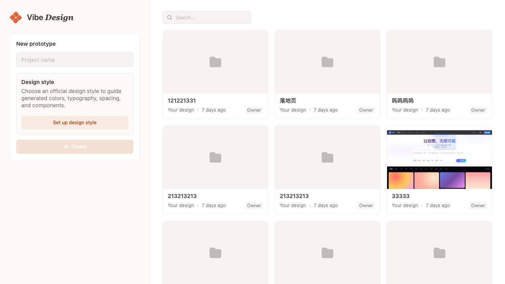
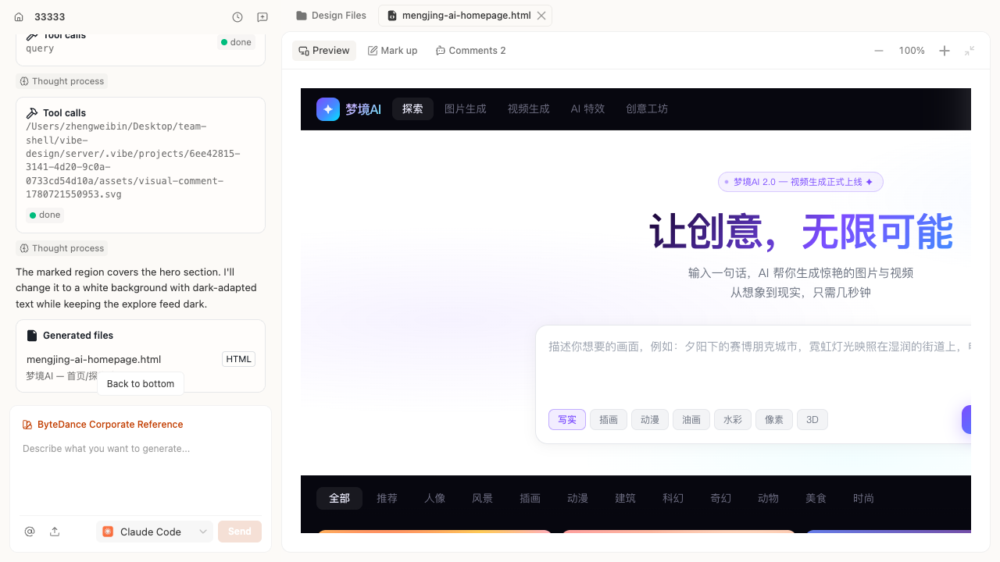

# Vibe Design

<p align="right">
  <a href="./README.md"><kbd>English</kbd></a>
  <a href="./README.zh-CN.md"><kbd>中文</kbd></a>
</p>



> **一句话生成可运行的真实原型，再用 AI 在同一个工作台里审查、批注、持续打磨。**

Vibe Design 是一个 AI 辅助的设计原型工作台。从一句需求开始，让生成结果落在真实的设计系统约束里，在交互式画布上预览实际效果，对需要改动的地方精确标注，再把视觉反馈直接交给本地编码 Agent（Codex 或 Claude Code）继续处理。项目、会话、文件和批注都会被保留——原型在多轮迭代中不断变好，而不是每次都从零开始。

灵感来自 Open Design，Vibe Design 让创作流程保持开放、可检查，并始终落在真实项目产物上。

## 为什么选择 Vibe Design

- **从需求到可运行原型** —— 描述一个界面，得到能打开、能点击的真实 HTML 和资源，而不是静态稿。
- **生成结果带设计系统约束** —— 选定官方设计系统后，它会成为生成上下文，让颜色、字体、间距、组件风格保持统一。
- **在画布上审查，而非在聊天里** —— 把评论钉在精确位置并附上截图，反馈始终绑定到具体文件和位置。
- **完整的视觉反馈闭环** —— 把带批注的反馈发回 Agent，在同一会话里持续迭代。
- **跑在你的本地 Agent 上** —— 使用你已安装的 Codex / Claude Code，改动发生在你自己的开发环境里。
- **是可持续的工作台，而非一次性生成器** —— 项目、会话、文件和批注在每一轮都保留。

## 功能特性

### 🎨 项目与设计系统

在首页创建项目、检索最近工作、选择官方设计系统。选定的设计系统会在 Agent 运行前注入为上下文，用来约束颜色、字体、间距、组件风格和整体产品语气。

### 💬 AI 会话式生成

项目编辑器围绕会话工作区构建。你可以选择本地 Agent、切换模型提供方、引用项目文件、附加视觉评论，让每一次生成和修改都保留正确的上下文。

### 🖼 画布预览与文件工作区

生成的 HTML、资源和项目文件会进入画布工作区。文件以标签页打开，支持预览、评论和标注模式；HTML 原型直接在画布中渲染，让你检查真实布局，而不是它的截图。



### 📌 视觉批注闭环

在预览中针对具体位置添加评论，并把截图附件一起发送给 Agent。设计反馈会绑定到具体文件和画布位置，而不会淹没在纯文本聊天记录里。

### 🤖 本地 Agent 运行时

服务端会检测本地 Codex 和 Claude Code 的安装、认证和可用状态，并在 UI 中提示问题。可用的 Agent 通过本地 runtime 启动，让整个流程在你自己的开发环境里处理项目文件。

### ⌨️ Agent 友好的 CLI

打包后的应用会注册 `tutti vibe-design` 只读命令。其他 Agent 可以通过 CLI 查看项目、会话、消息、文件、文件内容和预览评论，而不需要依赖内部 Web UI 路由。

## 工作流程

1. 在首页输入项目名称和需求描述。
2. 选择一个官方设计系统作为生成约束。
3. 进入项目编辑器，使用 Codex 或 Claude Code 生成原型文件。
4. 在画布中打开 HTML 预览，检查视觉层级、布局和内容。
5. 对具体区域添加批注或截图反馈。
6. 把反馈发送回 Agent，继续修改并保留完整会话历史。

## 适用人群

- 需要快速探索 SaaS、运营后台、内容工具、移动应用等界面方向的团队。
- 希望 AI 生成受真实设计系统约束、而非随机无风格输出的设计师和产品经理。
- 需要在生成原型上直接做视觉审查和批注的人。
- 希望 Agent 根据具体文件、截图和评论继续修改项目的工作流。
- 需要通过 CLI 只读访问项目上下文和文件资源的其他 Agent。

---

## 面向开发者

### 快速开始

依赖要求：

- 与仓库 Node 24 构建目标兼容的 Node.js。
- pnpm 10.x。
- 已安装并完成认证的 Codex 或 Claude Code，用于真实本地 Agent 运行。

```bash
pnpm install        # 安装依赖
make dev            # 启动开发服务，地址 http://127.0.0.1:3000/
make dev PORT=3100  # 指定端口
```

### 项目结构

```text
vibe-design/
|-- server/          # Express 服务、本地 Agent 运行时、持久化、API 和 CLI 路由
|-- web/             # React 应用、画布工作区、聊天 UI、服务和 SSR 渲染器
|-- skills/          # 内置 Vibe Design skills
|-- design-systems/  # 内置设计系统定义
|-- docs/            # 规格文档、实施计划和截图
|-- scripts/         # 打包和辅助脚本
`-- COMMANDS.md      # 公开 Tutti CLI 命令参考
```

`server` 通过 workspace 依赖 `@vibe-design/web` 使用前端渲染包。

### 运行时配置

| 变量 | 用途 | 默认值 |
| --- | --- | --- |
| `TUTTI_APP_HOST` 或 `HOST` | HTTP 绑定主机 | `127.0.0.1` |
| `TUTTI_APP_PORT` 或 `PORT` | HTTP 绑定端口 | `3000` |
| `TUTTI_APP_DATA_DIR` | 持久化项目、会话、skill 和设计系统数据 | 当前工作目录下的 `.vibe` |
| `VIBE_USER_SKILLS_DIR` | 用户导入的 skill 根目录 | `$TUTTI_APP_DATA_DIR/skills` |
| `VIBE_BUILTIN_SKILLS_DIR` | 内置 skill 根目录 | `skills/` |
| `VIBE_USER_DESIGN_SYSTEMS_DIR` | 用户可编辑的设计系统根目录 | `$TUTTI_APP_DATA_DIR/design-systems` |
| `VIBE_BUILTIN_DESIGN_SYSTEMS_DIR` | 内置设计系统根目录 | `design-systems/` |

### 常用命令

```bash
pnpm build:web          # 构建 Web 客户端和 CSS
pnpm build:server       # 打包服务端入口
pnpm start              # 构建 Web 产物后启动服务
pnpm test               # 运行全部 workspace 测试
pnpm type-check         # 运行 server 和 web 的 TypeScript 检查
pnpm test:package       # 测试 Tutti 应用包构建器
pnpm package:tutti-app  # 构建可分发的 Tutti 应用包
```

包级命令：

```bash
pnpm --filter @vibe-design/web test
pnpm --filter @vibe-design/server type-check
```

### Tutti CLI

Vibe Design 在 `vibe-design` scope 下注册只读 CLI。完整说明见 `COMMANDS.md`。

```bash
tutti --json vibe-design projects
tutti --json vibe-design conversations --project-id <id>
tutti --json vibe-design conversation-messages --project-id <id> --conversation-id <id>
tutti --json vibe-design files --project-id <id>
tutti --json vibe-design file-get --project-id <id> --name hero.html
tutti --json vibe-design comments --project-id <id> --conversation-id <id>
```

### 打包

```bash
pnpm package:tutti-app
```

打包结果会写入 `dist/tutti-app/vibe-design`，并校验运行时入口、manifest、server bundle、SQLite WASM、前端产物、内置 skills 和 design systems。发布前建议运行：

```bash
pnpm test
pnpm type-check
pnpm test:package
```

## 许可证

Vibe Design 使用 [Apache License 2.0](./LICENSE) 开源。
