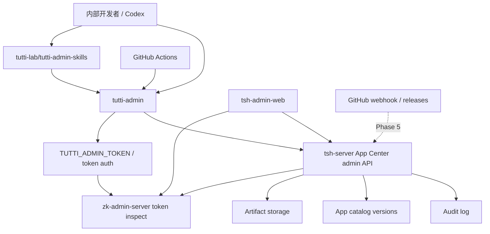

# Tutti 内部 CLI 与 Skills 平台规划

## 背景

现在 Tutti workspace app 的发布很依赖人工流程：应用仓库打 zip，再去 `admin.nextop.sh` 手动上传、创建版本、发布 latest。短期看，这是应用发版效率问题；长期看，这是 Tutti 云端内部开发者缺少统一操作入口的问题。

如果后续不止应用发布，还会有 agent 包审核、协作版本更新、模型授权、房间诊断、应用健康检查、灰度开关等内部操作，那么只为 app release 写一组脚本会很快变散。

更合理的方向是：

```text
Tutti 内部开发者
  -> Codex / Skill / 终端
  -> tutti-admin
  -> 管理后台受控 API
  -> admin audit / permission / artifact / release
```

## 结论

推荐采用 **CLI + Skills** 的双层方案。

- **CLI 是稳定执行层**：通用、可测试、可 CI 使用、可被人和 agent 调用。
- **Skills 是人机入口层**：描述 CLI 能力、规范操作步骤、让 Codex/agent 更容易正确调用 CLI。
- **管理后台是权限和审计层**：发放管理密钥，校验 token 有效性，记录操作来源。

不建议让每个 app 仓库自己写上传逻辑，也不建议让 skill 直接实现后台协议。

## Product Strategy Canvas

### 1. Vision

让 Tutti 云端内部开发者可以用统一、可审计、可自动化的方式完成平台操作，减少后台重复点击和 ad hoc 脚本。

### 2. Market Segments

第一批用户：

- Tutti app 开发者：需要打包、上传、发布 `vibe-design`、`ai-media-canvas` 等 app。
- 平台维护者：需要审核、回滚、诊断、更新云端配置。
- Agent/Codex 工作流：需要一个稳定 CLI 来完成受控操作，而不是靠浏览器模拟。

为什么先服务 app release：

- 痛点明确，频率高。
- 现有后台已经有 app-center API 和 artifact upload session 的基础。
- 很适合作为 CLI、密钥、审计、skill 编排的第一条样板链路。

### 3. Relative Costs

目标不是做一个复杂平台，而是把已经存在的后台能力做成更低成本的调用入口。

成本策略：

- 低复杂度起步：先 CLI 调现有 API。
- 中期扩展：CI 和 skill 调 CLI。
- 长期平台化：后台配置 GitHub source 和 webhook。

### 4. Value Proposition

对 app 开发者：

- 之前：每次发版都要手动进后台上传 zip。
- 之后：一条 CLI 或一句 Codex 指令完成打包、上传、创建版本、发布。

对平台维护者：

- 之前：很难判断某个版本来自哪个 commit、谁上传、是否校验过。
- 之后：所有操作经过管理 token、artifact SHA、Git SHA、审计日志。

对 agent 工作流：

- 之前：只能靠读文档、手动操作或浏览器 UI。
- 之后：skill 明确告诉 agent 如何调用 CLI，并把危险操作放到 CLI/API 权限控制里。

### 5. Trade-offs

明确不做：

- 不把上传、签名、publish 协议复制到每个 app repo。
- 不让 skill 直接实现 HTTP 上传协议。
- 不一开始就做完整 GitHub App 自动监听。
- 不让 CLI 使用个人浏览器 cookie 或非受控 session。
- 不把管理密钥设计成无限权限 token。

### 6. Key Metrics

North Star Metric：

- 内部平台操作中通过 CLI/skill 完成的受控操作占比。

季度 OMTM：

- app release 从“手动后台上传”到“CLI/CI 自动创建版本”的覆盖率。

辅助指标：

- 平均发布耗时。
- 发布失败可诊断率。
- 版本记录包含 Git SHA / artifact SHA 的比例。
- 回滚 latest 的平均耗时。

### 7. Growth

增长路径：

1. 从 `vibe-design` / `ai-media-canvas` 发布开始。
2. 扩展到所有 Tutti workspace app。
3. 扩展到 agent package、配置发布、诊断命令。
4. 接入 Codex plugin / skill，成为内部开发者默认入口。

### 8. Capabilities

需要建设的能力：

- 受控管理 CLI 仓库。
- Codex-compatible skills/plugin 仓库。
- 管理后台 token。
- app-center 机器 API。
- artifact 上传、校验、审计。
- GitHub Actions 调用方式。
- 后台 GitHub source 配置和 webhook 自动导入。

### 9. Can't / Won't

长期防御点：

- 统一 CLI 和后台权限模型会让内部操作可共享、可审计。
- skill 绑定 CLI 语义后，agent 不需要重复学习每个后台页面。
- 管理后台掌握密钥和审计，不会把发布权限散落在各个 app 仓库脚本里。

## 仓库规划

不要新建 `tutti-cli` / `tutti-agent-skills` 这类过泛名称，也不要复用 `tutti-os` 组织里的开源仓库。

原因：

- `tutti-os` 组织里已经有 `tutti-agent-skills`，描述就是 Tutti agent skills and plugin distribution repository。
- `tutti-os` 是开源组织，不适合承载内部开发者管理工具和内部密钥操作说明。
- `tutti-cli` 虽然当前没有看到重名，但语义太大，容易占用未来真正面向 Tutti 全平台的通用 CLI 名称。
- 这次要解决的是“管理后台受控操作”，边界更接近 `zk-admin-server` / `tsh-admin-web`，不应该命名成泛 Tutti 产品 CLI。

建议改成：

- CLI 新建在 `tutti-lab`：首选 `tutti-lab/tutti-admin-cli`
- Skills 新建在 `tutti-lab`：首选 `tutti-lab/tutti-admin-skills`

`tutti-admin-skills` 应参考 `tutti-os/tutti-agent-skills` 的分发规范，但不要复用它：

- 复用仓库布局、manifest 形态和校验方式。
- 不复用仓库名、插件名和 skill 内容。
- 不照搬 `tutti-agent-skills` 的 skill 内容或双 copy 同步模型。
- 不放内部 token、后台地址、权限说明到 `tutti-os` 开源组织。
- 内部仓库仍然可以保持 Codex plugin、Claude Code plugin、`npx skills add` 三种安装体验。

### 仓库一：受控管理 CLI

建议仓库名：

```text
tutti-lab/tutti-admin-cli
```

定位：

- Tutti / TSH 管理后台内部操作 CLI。
- 第一阶段实现 app release。
- 后续扩展 agent、diagnostics、config、room、model、admin 等命令。
- 只覆盖“需要管理后台权限和审计”的内部操作，不抢占未来面向普通用户的 Tutti CLI。

包名建议：

```text
@tutti-lab/tutti-admin-cli
```

命令名建议：

```text
tutti-admin
```

推荐命令结构：

```bash
tutti-admin auth login
tutti-admin auth token inspect
tutti-admin auth logout

tutti-admin app list --brand nextop
tutti-admin app list --brand nextop --query design
tutti-admin app detail --brand nextop --app-id vibe-design --include latest,versions
tutti-admin app create --brand nextop --app-id vibe-design --name "Vibe Design"
tutti-admin app edit --brand nextop --app-id vibe-design --name "Vibe Design" --status published
tutti-admin app validate --zip ./output/vibe-design-0.1.47.zip
tutti-admin app release --brand nextop --app-id vibe-design --zip ./output/vibe-design-0.1.47.zip
tutti-admin app release --brand nextop --app-id vibe-design --zip ./output/vibe-design-0.1.47.zip --publish --latest
tutti-admin app publish --brand nextop --app-id vibe-design --version 0.1.47 --latest
tutti-admin app rollback --brand nextop --app-id vibe-design --version 0.1.46
tutti-admin app archive --brand nextop --app-id vibe-design --version 0.1.45

tutti-admin auth whoami
tutti-admin system health
```

命令不应该把后台 API 一比一摊平。建议 CLI 保持少命令、高阶语义：

- `app list --query` 覆盖搜索，不再单独提供 `app search`。
- `app detail --include latest,versions` 覆盖 latest 查询、版本列表和版本详情的大部分读取场景。
- `app release` 内部完成 validate、artifact upload、create version。
- `app publish --latest` 表达“发布并设为 latest”，不再暴露单独的 `app latest` 常用命令。
- `app rollback` 表达“把 latest 指回旧版本”，比 `latest set` 更符合用户语义。
- `app validate` 保留为本地预检命令，但 `app release` 会自动执行 validate。
- `app upload`、`app version detail`、`app latest get` 可以作为内部 API 能力或 debug 命令，不进入第一阶段公开 CLI。

第一阶段建议把 app catalog 和 release 链路都做完整，但命令面保持收敛。否则 agent 虽然能发布版本，但遇到 app 名称、描述、分类、图标、状态需要调整时，仍然要回到后台手动编辑。

第一阶段实现：

```bash
tutti-admin app list
tutti-admin app detail
tutti-admin app create
tutti-admin app edit
tutti-admin app validate
tutti-admin app release
tutti-admin app publish
tutti-admin app rollback
tutti-admin app archive
```

查询类命令必须先做，原因：

- 发布前需要知道 app 是否存在，不存在时提示先 `app create` 或走后台审批。
- 发布前需要知道当前 latest，避免误覆盖。
- CI 需要能判断同版本是否已存在，做到幂等。
- rollback 需要能列出已发布版本。
- skill 需要用 `list/detail` 给用户展示上下文，而不是盲发命令。

其中日常发布主路径是：

```bash
tutti-admin app detail
tutti-admin app validate
tutti-admin app release
tutti-admin app publish
```

`app create/edit/archive/rollback` 属于完整后台替代能力：

- `app create`：新应用首次接入时需要。
- `app edit`：修改名称、描述、图标、分类、状态、可见性等 app catalog 字段。
- `app archive`：下线旧版本。
- `app rollback`：把 latest 指回旧版本。

CLI 职责：

- 读取 zip 中的 `tutti.app.json`。
- 校验 `appId`、`version`、`runtime.bootstrap`、`runtime.healthcheckPath`。
- 计算 artifact SHA256 和 size。
- 调用后台创建 artifact upload session。
- 上传 zip。
- 创建版本。
- 根据参数 publish / set latest。
- 输出后台链接和审计信息。

CLI 不负责：

- 自己决定谁有权限。
- 绕过后台直接写对象存储。
- 复制管理后台业务规则。
- 持有全局万能密钥。

### 仓库二：内部 Skills / Plugin

新建内部仓库：

```text
tutti-lab/tutti-admin-skills
```

定位：

- 内部 Codex-compatible plugin/skills 分发仓库。
- 参考 `tutti-os/tutti-agent-skills` 的 repository layout 和 manifest 规范。
- 给 agent 描述 `tutti-admin` 的能力、参数、风险和标准流程。
- 让用户可以说“帮我打包并上传 vibe-design 到 nextop”，agent 自动走 `tutti-admin`。
- 不放到 `tutti-os`，避免把内部后台能力和密钥流程暴露到开源组织。

推荐仓库结构：

```text
.
├── .agents/plugins/marketplace.json
├── .claude-plugin/marketplace.json
├── .codex-plugin/plugin.json
├── assets/icon.png
└── skills/
    └── tutti-app-release/
```

这样做的原因：

- `skills/` 是唯一 skill source of truth。
- 根目录 `skills/` 支持直接 `npx skills add tutti-lab/tutti-admin-skills`。
- `.agents/plugins/marketplace.json` 提供 Codex marketplace 入口。
- `.claude-plugin/marketplace.json` 提供 Claude Code marketplace 入口。
- `.codex-plugin/plugin.json` 支持 Codex 从仓库根目录直接发现插件。
- Codex / Claude plugin manifest 都指向同一处 `skills/`，不维护两份 skill copy。
- 如果某个 marketplace 工具强制要求 plugin 目录内包含 `skills/`，也应该通过构建脚本生成发布产物，不在源仓库里手动维护双份内容。

推荐 skill：

```text
tutti-app-release
tutti-admin-diagnostics
tutti-agent-package-review
tutti-config-release
```

第一阶段只做：

```text
tutti-app-release
```

Skill 职责：

- 识别当前 repo 是不是 Tutti app。
- 读取 `tutti.app.json`。
- 运行 repo 的 package/test 命令。
- 调用 `tutti-admin app release`。
- 解释发布结果。
- 对危险操作，比如 `--publish --latest`，要求明确用户确认。

Skill 不负责：

- 手写 HTTP 上传。
- 保存管理密钥。
- 伪造后台权限。

## 管理密钥方案

是的，管理后台需要有一个 **内部管理 API Token**，CLI 不能随意调用后台接口。

第一版不要把 token 机制做得太复杂。建议做成类似 GitHub Personal Access Token 的模式：

1. 用户先用现有方式登录 `admin.nextop.sh`。
2. 在管理后台里创建一个内部管理 token。
3. 后台只展示一次 token 明文。
4. CLI 通过粘贴 token 或读取 `TUTTI_ADMIN_TOKEN` 使用。
5. `zk-admin-server` 校验 token hash、过期时间、是否撤销。
6. `tsh-server` 的 App Center admin 路由通过 token inspect 获取 user id，再按现有 admin 权限执行 app-center 操作并写审计日志。

### Token 形态

建议叫：

```text
TUTTI_ADMIN_TOKEN
```

或更精确：

```text
TUTTI_CLOUD_TOKEN
```

第一版 token 只需要具备：

- 名称，例如 `vibe-design local release`、`github-actions ai-media-canvas`。
- token 明文只展示一次。
- token hash 存储，不能明文落库。
- 过期时间，必须有。
- 创建人。
- 创建原因 / 备注。
- 最后使用时间。
- 可撤销。

第一版暂时不做细粒度限制：

- 不强制 scope。
- 不强制 brand allowlist。
- 不强制 app allowlist。
- 不区分 `app:release` / `app:publish` / `app:latest`。

这样可以先把 CLI 发布链路跑通，避免第一阶段把权限模型做得过重。

### Token 有效期建议

Token 不应该永久有效。

第一版建议：

- 默认有效期 90 天。
- 允许创建时选择 7 天、30 天、90 天、180 天。
- 先不做 refresh token。
- 到期后重新到 admin web 创建新 token。
- 支持随时 revoke。

后续增强时再分两类：

1. 用户登录 token  
   通过浏览器授权或 device flow 获取短期 access token。

2. 服务账号 token  
   给 GitHub Actions / CI 使用，支持 scope、brand、app allowlist。

CLI 在每次调用前应该做：

- 本地 token 是否存在。
- token 是否已过期。
- 如果过期，直接失败并提示去 admin web 重新创建。
- 如果 token 被 revoke，直接失败并提示重新配置。

### CLI 登录机制

第一版 `tutti-admin auth login` 不是用户名密码登录，也不是 OAuth。

它做的是“配置 token”：

```bash
tutti-admin auth login --admin-url https://admin.nextop.sh
```

交互流程：

```text
1. CLI 提示打开 admin.nextop.sh -> 管理密钥 -> 新建 token
2. 用户复制 token
3. CLI 提示粘贴 token
4. CLI 调用 `/api/v1/admin/auth/token/inspect` 验证 token
5. 验证通过后保存 adminUrl 和 token
```

本地保存位置：

- 优先系统 keychain。
- 如果没有 keychain，再保存到 `~/.config/tutti-admin/config.json`。
- 文件权限必须限制为当前用户可读写。

CI 使用方式：

```bash
TUTTI_ADMIN_TOKEN=... tutti-admin app release --config .tutti-release.json
```

后续可以再做 refresh token / 浏览器授权：

```http
POST /v1/admin/auth/token/refresh
POST /v1/admin/cli/device/start
POST /v1/admin/cli/device/complete
```

但这不是 MVP 必需。

### Token 管理 UI

`tutti-lab/tsh-admin-web` 需要增加页面，或在现有后台导航中新增“管理密钥”入口：

```text
NEXTOP 运营
  -> 管理密钥
    -> 新建密钥
    -> 输入名称
    -> 输入备注
    -> 设置过期时间
    -> 复制一次性 token
    -> 查看使用记录
    -> 撤销
```

### Token 服务端能力

`tutti-lab/zk-admin-server` 需要支持：

- 创建 token。
- token 过期时间。
- token hash 存储。
- token 鉴权中间件。
- 审计日志。
- token revoke。
- token last used 记录。
- token 即将过期查询。
- token inspect。

第一版 server 接口建议：

```http
POST /api/v1/admin/tokens
GET  /api/v1/admin/tokens
GET  /api/v1/admin/tokens/:tokenId
POST /api/v1/admin/tokens/:tokenId/revoke
POST /api/v1/admin/auth/token/inspect
```

后续增强再加：

- token rotate。
- scope / brand / app 校验。
- device login。
- service account。

CLI 请求头建议：

```http
Authorization: Bearer <TUTTI_ADMIN_TOKEN>
```

或：

```http
X-Tutti-Admin-Token: <token>
```

推荐优先用标准 `Authorization: Bearer`。

## 管理后台改造范围

### 服务端：`tutti-lab/zk-admin-server` + `tutti-lab/tsh-server`

需要补齐：

1. 管理密钥模型。
2. token inspect 接口。
3. `tsh-server` App Center API 支持 Bearer token 调用。
4. artifact upload session 的 token 调用支持。
5. 版本创建、publish、latest、rollback 的审计字段。
6. 可选：GitHub webhook 导入接口。

第一阶段重点：

```http
GET  /api/desktop/v1/admin/app-center/apps
POST /api/desktop/v1/admin/app-center/apps
PATCH /api/desktop/v1/admin/app-center/apps/:appId
GET  /api/desktop/v1/admin/app-center/apps/:appId/versions
POST /api/desktop/v1/admin/app-center/artifact-upload-sessions
POST /api/desktop/v1/admin/app-center/apps/:appId/versions
POST /api/desktop/v1/admin/app-center/apps/:appId/versions/:versionId/publish
POST /api/desktop/v1/admin/app-center/apps/:appId/versions/:versionId/set-latest
POST /api/desktop/v1/admin/app-center/apps/:appId/versions/:versionId/archive
```

这些接口需要能被机器 token 调用。第一版只校验 token 是否有效、未过期、未撤销，并记录审计。

scope 可以作为后续增强：

- `app:read`：允许 list/query/detail/versions/latest read。
- `app:create`：允许 create app catalog item。
- `app:edit`：允许 edit app catalog metadata/status/visibility。
- `app:release`：允许 upload artifact + create version。
- `app:publish`：允许 publish version。
- `app:latest`：允许 set latest / rollback。
- `app:archive`：允许 archive version。

CLI 里 `app release` 应先调用读接口，但这些不需要暴露成多个用户命令：

1. 读取 app detail，确认 app 存在。
2. 读取 current latest，避免误覆盖。
3. 读取 versions，判断目标 version 是否已存在。
4. validate zip。
5. upload artifact / create version。

### 前端：`tutti-lab/tsh-admin-web`

需要补齐：

1. 管理密钥页面。
2. 应用版本页展示发布来源：manual / cli / github-actions / github-webhook。
3. 版本详情展示 token subject、Git SHA、artifact SHA、workflow URL。
4. 可选：GitHub source 配置页面。

第一阶段可以只做：

- 管理密钥页面。
- 版本列表展示 `source` / `createdBy`。

## GitHub Actions 接入

每个 app repo 后续只需要加很薄的一层：

```yaml
name: Publish Tutti App

on:
  push:
    branches: [main]
  release:
    types: [published]

jobs:
  package:
    runs-on: ubuntu-latest
    environment: nextop-app-release
    steps:
      - uses: actions/checkout@v4
      - uses: pnpm/action-setup@v4
      - run: pnpm install --frozen-lockfile
      - run: pnpm test:package
      - run: pnpm package:cloud
      - run: npx @tutti-lab/tutti-admin-cli app release --config .tutti-release.json
        env:
          TUTTI_ADMIN_TOKEN: ${{ secrets.TUTTI_ADMIN_TOKEN }}
```

`.tutti-release.json`：

```json
{
  "adminUrl": "https://admin.nextop.sh",
  "brand": "nextop",
  "appId": "vibe-design",
  "zipPattern": "output/vibe-design-*.zip"
}
```

推荐策略：

- PR：只 validate/package，不发布。
- main：创建版本记录。
- release/tag：publish + set latest。
- latest 切换可以通过 GitHub Environment approval 或后台人工确认。

## GitHub 后台监听方案

这是长期方案，不建议第一阶段做。

后台可以在应用详情里配置：

```json
{
  "sourceRepo": "tutti-os/vibe-design",
  "branchPattern": "main",
  "tagPattern": "v*",
  "workflowName": "publish-tutti-app.yml",
  "artifactPattern": "vibe-design-*.zip",
  "autoPublishPolicy": "draft"
}
```

后台通过 GitHub App 监听：

- `workflow_run`
- `release`
- `push tag`

然后下载 artifact，调用同一套 app release service 创建版本。

好处：

- app repo 不需要保存后台 token。
- 发布策略集中在 admin。

代价：

- 需要 GitHub App。
- 需要 webhook 安全验证。
- 需要 artifact 下载和重试。
- 需要幂等和排障页面。

所以这应该是 Phase 3，不是当前第一步。

## CLI 与 Skill 的边界

### CLI 是事实来源

CLI 负责真实执行：

```text
validate -> upload artifact -> create version -> publish/latest
```

CLI 可以被这些入口调用：

- 本地终端。
- GitHub Actions。
- Codex skill。
- 其他内部自动化。

### Skill 是操作说明和编排

Skill 负责把自然语言变成安全命令：

用户说：

```text
帮我把 vibe-design 打包上传到 nextop
```

Skill 执行：

```bash
pnpm package:cloud
tutti-admin app release --config .tutti-release.json
```

如果用户说：

```text
直接发 latest
```

Skill 应该确认：

```text
这会切换 nextop/vibe-design 的线上 latest 到 0.1.47，是否继续？
```

## Agent 用户流校验

从 agent 视角看，当前方案基本能满足“减少手动后台上传”的核心诉求，但要把 skill 写得足够清楚，避免 agent 盲发命令。

### 用户流 1：首次配置

用户说：

```text
帮我配置 tutti-admin 发布权限
```

Agent 应该做：

1. 检查本机是否安装 `tutti-admin`。
2. 如果没有安装，提示安装 `@tutti-lab/tutti-admin-cli`。
3. 执行 `tutti-admin auth token inspect` 或检查本地配置。
4. 如果没有 token，提示用户打开 `admin.nextop.sh -> 管理密钥 -> 新建密钥`。
5. 引导用户执行 `tutti-admin auth login --admin-url https://admin.nextop.sh`。
6. 验证通过后告诉用户当前登录状态。

是否满足：满足。第一版不需要 OAuth/device flow，agent 只需要引导用户复制一次 token。

### 用户流 2：创建版本

用户说：

```text
帮我把 vibe-design 打包并上传到 nextop
```

Agent 应该做：

1. 读取 `tutti.app.json`，确认 `appId/version/runtime`。
2. 运行 package/test，例如 `pnpm test:package`、`pnpm package:cloud`。
3. 调用 `tutti-admin app detail --brand nextop --app-id vibe-design --include latest,versions`。
4. 如果版本不存在，调用 `tutti-admin app release --brand nextop --app-id vibe-design --zip <zip>`。
5. 返回 version、artifact SHA、后台链接。

是否满足：满足。关键是 CLI 必须提供 read 命令，否则 agent 无法在创建版本前给用户解释上下文。

### 用户流 3：发布 latest

用户说：

```text
直接发 latest
```

Agent 不应该直接执行。它必须先展示：

- appId。
- 当前 latest。
- 即将发布的新 version。
- Git SHA。
- artifact SHA。
- 是否会切换线上 latest。

然后询问确认：

```text
确认把 nextop/vibe-design latest 从 0.1.46 切到 0.1.47 吗？
```

确认后再执行：

```bash
tutti-admin app publish --brand nextop --app-id vibe-design --version 0.1.47 --latest
```

是否满足：基本满足。skill 必须把 latest 作为危险操作，要求用户明确确认。

### 用户流 4：查询最新版本

用户说：

```text
看一下 ai-media-canvas 现在最新版本是多少
```

Agent 应该执行：

```bash
tutti-admin app detail --brand nextop --app-id ai-media-canvas --include latest,versions
```

返回：

- latest version。
- latest 更新时间。
- 最近几个 version。
- 状态：draft / published / archived。

是否满足：满足。CLI 只暴露 `detail --include latest,versions`，server 内部仍可提供细粒度 `detail/latest/versions` 接口。

### 用户流 5：编辑应用信息

用户说：

```text
把 vibe-design 的描述改成 Prototype design tool
```

Agent 应该执行：

```bash
tutti-admin app detail --brand nextop --app-id vibe-design
tutti-admin app edit --brand nextop --app-id vibe-design --description "Prototype design tool"
tutti-admin app detail --brand nextop --app-id vibe-design
```

如果变更涉及状态、可见性、latest 指针、分类等会影响用户可见性的字段，Agent 应该先展示 diff 并要求确认。

是否满足：需要 CLI 提供 `app edit`，server 提供 `PATCH /api/desktop/v1/admin/app-center/apps/:appId`。这应该纳入第一阶段，否则 app catalog 仍然依赖后台手动编辑。

### 用户流 6：token 失效

如果 CLI 返回 token expired / revoked，Agent 应该：

1. 停止发布。
2. 不要求用户把 token 发给 agent。
3. 提示用户去 `admin.nextop.sh -> 管理密钥` 重新创建 token。
4. 引导用户重新执行 `tutti-admin auth login`。

是否满足：满足。第一版 token 不做 refresh，因此失败提示要清晰。

### 用户流 7：版本已存在

如果目标 version 已存在，Agent 不应该直接覆盖。

Agent 应该提示用户选择：

- 跳过发布。
- 只 publish 已存在版本。
- bump version 后重新打包。
- 如果是 draft，后续可以支持 `--replace-draft`，但第一版不建议默认做。

是否满足：需要 CLI 返回清晰的 `VERSION_ALREADY_EXISTS`，并且 skill 里写明处理策略。

### 用户流结论

当前方案满足核心诉求：

- 用户不用再手动上传 zip。
- Agent 可以引导创建 token。
- Agent 可以查询 app 和版本上下文。
- Agent 可以创建版本。
- latest 操作有确认点。
- token 失效时有恢复路径。

还需要补齐的产品细节：

- CLI 错误码要稳定，例如 `TOKEN_EXPIRED`、`TOKEN_REVOKED`、`APP_NOT_FOUND`、`VERSION_ALREADY_EXISTS`、`ARTIFACT_UPLOAD_FAILED`。
- Skill 需要明确哪些操作可以自动执行，哪些必须用户确认。
- CLI 输出最好支持 JSON，方便 agent 解析：

```bash
tutti-admin app release --brand nextop --app-id vibe-design --zip ./output/vibe-design.zip --json
```

## 阶段计划

### Phase 0：确认现有 API 契约

产出：

- app-center API 列表。
- artifact upload session 调用契约。
- 当前版本状态机。
- token 鉴权缺口。
- token 有效期、refresh、revoke 规则。
- CLI 稳定错误码约定。
- CLI JSON 输出格式。

### Phase 1：CLI MVP

产出：

- `tutti-lab/tutti-admin-cli` 仓库。
- `tutti-admin app list/detail`。
- `tutti-admin app create/edit`。
- `tutti-admin app validate`。
- `tutti-admin app release`。
- `tutti-admin app publish`。
- `tutti-admin app rollback/archive`。
- `--json` 输出。
- 稳定错误码：`TOKEN_EXPIRED`、`TOKEN_REVOKED`、`APP_NOT_FOUND`、`VERSION_ALREADY_EXISTS`、`ARTIFACT_UPLOAD_FAILED`。
- README 和 CI。

验收：

- 本地无需打开 admin UI，可以创建 app version。
- 本地无需打开 admin UI，可以创建和编辑 app catalog。
- 发布前可以查询当前 latest 和已有版本。
- zip appId/version 校验失败时阻断。
- 后台能看到 createdBy/source/gitSha/artifactSha。
- Agent 可以解析 CLI JSON 输出并给用户解释结果。

### Phase 2：管理密钥

产出：

- `zk-admin-server` token 模型和 inspect 接口。
- `tsh-server` App Center admin 路由支持 Bearer token。
- `tsh-admin-web` token 管理页面。
- token 创建、inspect、revoke、last used、过期提示。

验收：

- token 过期后不能继续调用。
- token revoke 后不能继续调用。
- 后台能看到 token 创建人、最后使用时间、相关审计。
- token 可撤销。

### Phase 3：GitHub Actions 模板

产出：

- app repo workflow 模板。
- `.tutti-release.json` 规范。
- `vibe-design` 和 `ai-media-canvas` 接入。

验收：

- main merge 自动创建版本记录。
- release tag 可 publish latest。
- CI 日志输出后台版本链接。

### Phase 4：Skills / Plugin

产出：

- `tutti-lab/tutti-admin-skills` 内部仓库。
- `tutti-app-release` skill。
- 参考 `tutti-os/tutti-agent-skills` 的 plugin/skills 分发结构。
- `.agents/plugins/marketplace.json`。
- `.claude-plugin/marketplace.json`。
- `.codex-plugin/plugin.json`。
- 单一 `skills/tutti-app-release/` source of truth。

验收：

- Codex 能按 skill 自动打包并调用 CLI。
- Claude Code 能通过 marketplace 安装同一套 skill。
- `npx skills add` 能直接安装根目录 skills。
- 仓库里不维护双份 skill copy。
- latest 操作需要明确确认。
- skill 不保存密钥，不手写上传协议。

### Phase 5：后台 GitHub source 绑定

产出：

- `tsh-admin-web` GitHub source 配置。
- `zk-admin-server` 或独立 admin import service 的 GitHub webhook/import service。
- 后台版本自动导入记录。

验收：

- 后台可以配置 repo/workflow/artifact。
- GitHub release 后自动创建版本。
- 失败时后台可见原因并可重试。

## 风险

1. 机器 token 过大  
   第一版先用过期时间、撤销、审计控制风险；scope、brand、app allowlist 放到后续增强。

2. CLI 与后台 UI 规则不一致  
   CLI 不应该复制业务规则，规则放后台；CLI 只做客户端校验和友好报错。

3. skill 变成第二套实现  
   skill 只能调用 CLI，不能自己实现上传协议。

4. 自动 latest 风险  
   第一阶段默认不自动 latest。latest 要显式参数和权限。

5. 多仓库维护成本  
   CLI 和 skills 分仓库是合理的：CLI 是工具包生命周期，skills 是 agent/plugin 生命周期；但需要在 README 里明确版本兼容关系。

## 推荐命名

### CLI 命名候选

| 仓库名 | npm 包 | 命令名 | 评价 |
| --- | --- | --- | --- |
| `tutti-lab/tutti-admin-cli` | `@tutti-lab/tutti-admin-cli` | `tutti-admin` | 首选。直白、内部属性清楚，绑定 Tutti 内部管理域，后续 app、agent、config、diagnostics 都能放。 |
| `tutti-lab/tsh-admin-cli` | `@tutti-lab/tsh-admin-cli` | `tsh-admin` | 最直白，但名字偏长，命令也稍重。 |
| `tutti-lab/tsh-ops-cli` | `@tutti-lab/tsh-ops-cli` | `tsh-ops` | 强调运维/内部操作，适合 diagnostics、release、rollback，但 admin API 感弱一点。 |
| `tutti-lab/tutti-cloud-admin-cli` | `@tutti-lab/tutti-cloud-admin-cli` | `tutti-cloud-admin` | 边界清楚但太长，也会重新引入泛 Tutti 命名。 |
| `tutti-lab/nextop-admin-cli` | `@tutti-lab/nextop-admin-cli` | `nextop-admin` | 如果只服务 nextop 很清楚，但未来多 brand 会受限。 |
| `tutti-lab/app-center-cli` | `@tutti-lab/app-center-cli` | `app-center` | 对 app release 很准，但后续扩展 agent/config/diagnostics 会显窄。 |
| `tutti-lab/tutti-release-cli` | `@tutti-lab/tutti-release-cli` | `tutti-release` | 只适合发布，不适合管理密钥、诊断、审核等能力。 |
| `tutti-lab/tsh-platform-cli` | `@tutti-lab/tsh-platform-cli` | `tsh-platform` | 比 `tutti-cli` 收敛，但仍偏平台大词。 |

命名判断：

- 如果目标是“只做 app release”，可以叫 `app-center-cli` 或 `tutti-release-cli`。
- 如果目标是“管理后台内部操作入口”，推荐 `tutti-admin` 或 `tsh-admin-cli`。
- 如果目标是“未来云端运维入口”，可以考虑 `tsh-ops-cli`。
- 不推荐 `tutti-cli`，太泛。
- 不推荐 `nextop-admin-cli`，太 brand-specific。

首选：

- CLI 仓库：`tutti-lab/tutti-admin-cli`
- Skills 仓库：`tutti-lab/tutti-admin-skills`
- npm 包：`@tutti-lab/tutti-admin-cli`
- 命令名：`tutti-admin`
- Token 环境变量：`TUTTI_ADMIN_TOKEN`

备选：

- CLI 仓库：`tutti-lab/tutti-cloud-admin-cli`
- npm 包：`@tutti-lab/tutti-cloud-admin-cli`
- 命令名：`tutti-cloud-admin`

我更建议 `tutti-admin-cli` / `tutti-admin` 这一组。它比 `tshctl` 更好懂，比 `tutti-cli` 更收敛：明确表达“这是 Tutti 内部管理操作入口”，但又不局限在 app release，后续 agent 包审核、配置发布、诊断、room 日志都能自然扩展。

## 最终形态



## 建议下一步

1. 在 `tutti-lab` 新建 `tutti-admin-cli`。
2. 在 `zk-admin-server` 增加管理密钥创建、列表、撤销和 inspect。
3. 在 `tsh-server` 增加 App Center Bearer token inspect 鉴权。
4. 在 `tsh-admin-web` 增加管理密钥页面。
5. 先用 `vibe-design` 做 CLI MVP 验证。
6. 再接 `ai-media-canvas` 和 GitHub Actions。
7. 最后新建并接入 `tutti-lab/tutti-admin-skills`，提供内部 Codex plugin 体验。
