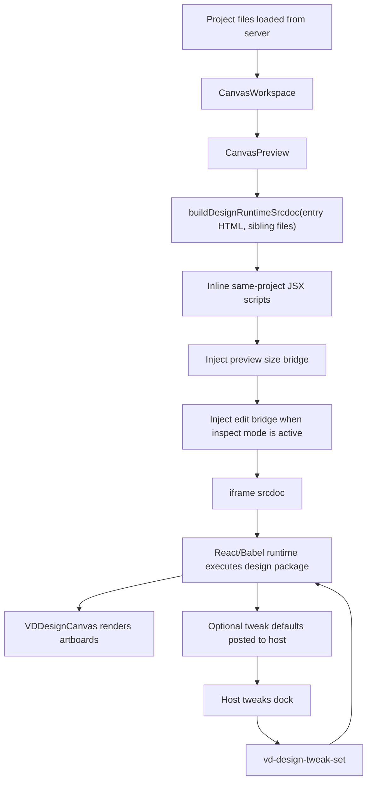

# Vibe Design Multi-File Design Runtime Preview

## Context

This spec covers the first Vibe Design implementation phase for multi-file design-runtime previews:

- entry HTML such as `index.html`
- sibling runtime source files such as `design-canvas.jsx`, `tweaks-panel.jsx`, `inbox.jsx`, `emails.jsx`, and `app.jsx`
- a design runtime that renders multiple artboards on one canvas
- tweak defaults declared with `/*EDITMODE-BEGIN*/ ... /*EDITMODE-END*/`

The design is based on the current `vibe-design` codebase and the user-provided HTML entrypoint:

- `/Users/zhengweibin/Desktop/team-shell/vibe-design/web/src/features/canvas-workspace/CanvasPreview.tsx`
- `/Users/zhengweibin/Desktop/team-shell/vibe-design/web/src/features/canvas-workspace/runtime/build-preview-srcdoc.ts`
- `/Users/zhengweibin/Desktop/team-shell/vibe-design/web/src/features/canvas-workspace/CanvasWorkspace.tsx`
- `/Users/zhengweibin/Desktop/team-shell/vibe-design/server/src/server.ts`
- `/Users/zhengweibin/Desktop/team-shell/vibe-design/server/src/routes/project-routes.ts`

## Goal

Support a generated design package where `index.html` loads multiple sibling JSX files and renders a comparison canvas inside Vibe Design.

The first phase must make the design run reliably in both:

- active canvas preview
- design file detail preview

The second phase should add host-owned tweak controls that can update runtime values without rebuilding the whole project file.

## Non-Goals

- Do not build a full JavaScript bundler.
- Do not compile JSX at save time.
- Do not replace the existing iframe preview architecture.
- Do not change project file storage or the `/api/projects/:id/files/:name` route contract.
- Do not implement source-code editing for JSX files in this phase.
- Do not make the iframe design runtime depend on `@tutti-os/ui-system`.
- Do not migrate the existing inspect panel behavior into this runtime.

## Current State

`CanvasPreview` already supports HTML through two iframe modes:

- URL mode: uses `file.url` when the active HTML file has a raw project-file URL and the canvas is not in inspect mode.
- srcdoc mode: uses `file.contents`, optionally injecting the edit bridge and size bridge.

The server already prepares project files with:

- `contents` for non-image files
- `url` for every stored project file

The server also exposes raw project files through:

```text
GET /api/projects/:id/files/:name
```

This means an `index.html` URL preview can already load sibling files by relative URL:

```html
<script type="text/babel" src="app.jsx"></script>
```

When the iframe URL is `/api/projects/demo/files/index.html`, the browser resolves `app.jsx` to `/api/projects/demo/files/app.jsx`.

The gap is `srcdoc`: once the HTML is rendered as inline `srcDoc`, relative script URLs no longer have the project-file URL as their base. Existing design file detail preview also uses `srcDoc`, so multi-file runtime previews are incomplete there.

## Source To Target Concept Mapping

| Source Concept | Vibe Design Concept |
| --- | --- |
| Reference design canvas runtime | Vibe design runtime preview |
| `DesignCanvas` | `VDDesignCanvas` iframe-local runtime canvas root |
| `DCSection` | `VDSection` iframe-local artboard group |
| `DCArtboard` | `VDArtboard` iframe-local artboard frame |
| `useTweaks` | `useVDTweaks` iframe runtime tweak state plus optional host bridge |
| `TweaksPanel` | `VDTweaksPanel` or phase-two host-owned tweak dock |
| `TweakColor` | `VDTweakColor` or host-owned color control mapped to runtime tweak value |
| `TWEAK_DEFAULTS` | parsed design runtime defaults |
| `/*EDITMODE-BEGIN*/` | tweak-default extraction marker |
| `/*EDITMODE-END*/` | tweak-default extraction marker |
| sibling `*.jsx` files | project files in the same Vibe Design project |
| HTML entrypoint | `WorkspaceFile` with `kind: 'html'` |

Generated design packages should use `VD`-prefixed component and hook names. Imported reference examples can be used for behavior, but generated source should be rewritten into Vibe Design naming instead of keeping generic `DesignCanvas`, `DCSection`, `DCArtboard`, or `useTweaks` identifiers.

Expected generated JSX shape:

```jsx
function App() {
  const [t, setTweak] = useVDTweaks(TWEAK_DEFAULTS);

  return (
    <VDDesignCanvas>
      <VDSection id="otp" title="Tutti · OTP sign-in email">
        <VDArtboard id="v-a" label="A · Terminal" width={1010} height={820}>
          <EmailVariantA primary={t.primaryColor} />
        </VDArtboard>
      </VDSection>
    </VDDesignCanvas>
  );
}
```

## Protocols That Must Stay Stable

Existing project-file route:

```text
GET /api/projects/:id/files/:name
```

Existing canvas edit bridge messages must not be renamed or weakened:

```text
vd-edit-targets
vd-edit-hover
vd-edit-select
vd-edit-text-commit
vd-edit-selected-target
vd-edit-preview-style
vd-edit-preview-style-reset
vd-edit-preview-style-applied
```

Existing preview size bridge message must stay stable:

```text
vd-preview-size
```

New design runtime messages should use the existing `vd-*` namespace:

```ts
type DesignRuntimeHostMessage =
  | { type: 'vd-design-runtime-ready'; entryPath: string; tweakDefaults: Record<string, unknown> }
  | { type: 'vd-design-tweak-changed'; key: string; value: unknown; tweaks: Record<string, unknown> };

type DesignRuntimeIframeCommand =
  | { type: 'vd-design-tweak-set'; key: string; value: unknown }
  | { type: 'vd-design-tweaks-reset'; tweaks?: Record<string, unknown> };
```

These messages are additive. They should not replace the edit bridge protocol.

## Phase 1 Design: Multi-File Runtime Srcdoc

Add a runtime builder that can turn an HTML entry file and its sibling project files into a self-contained srcdoc.

Proposed module:

```text
web/src/features/canvas-workspace/runtime/build-design-runtime-srcdoc.ts
```

Public shape:

```ts
interface BuildDesignRuntimeSrcdocFile {
  name: string;
  path: string;
  contents?: string;
  mime: string;
}

interface BuildDesignRuntimeSrcdocOptions {
  entryFile: BuildDesignRuntimeSrcdocFile;
  files: BuildDesignRuntimeSrcdocFile[];
  editBridge: boolean;
  sizeBridge?: boolean;
}

function buildDesignRuntimeSrcdoc(options: BuildDesignRuntimeSrcdocOptions): string;
```

Behavior:

1. Start from the entry HTML contents.
2. Parse only same-project relative script references.
3. Inline supported sibling source files into the document.
4. Keep remote scripts such as React, ReactDOM, and Babel unchanged.
5. Keep unsupported or missing sibling scripts in place and mark them with a diagnostic `data-vd-missing-source` attribute.
6. Reuse `buildPreviewSrcdoc` for edit bridge and size bridge injection after dependency inlining.

Supported inline script references:

```html
<script type="text/babel" src="app.jsx"></script>
<script src="./app.jsx"></script>
<script src="components/app.jsx"></script>
```

References that must not be inlined:

```html
<script src="https://unpkg.com/react@18.3.1/umd/react.development.js"></script>
<script src="/absolute/app.jsx"></script>
<script src="../outside-project.jsx"></script>
```

Inlining output:

```html
<script type="text/babel" data-vd-source="app.jsx">
  /* original app.jsx contents */
</script>
```

This keeps the iframe independent from URL resolution in `srcDoc` mode while preserving the original HTML entrypoint semantics.

## Phase 1 Integration

Update `CanvasPreview`:

- Add optional `files?: WorkspaceFile[]`.
- For HTML `srcDoc`, call `buildDesignRuntimeSrcdoc` instead of `buildPreviewSrcdoc` when project sibling files are available.
- Keep URL mode unchanged for normal preview.
- Keep edit mode behavior unchanged except that the srcdoc now has sibling JSX inlined before bridge injection.

Update `CanvasWorkspace`:

- Pass `files` into `CanvasPreview`.
- Update `HtmlDesignFilePreview` to use the same builder so the file detail preview can render multi-file design packages.

No server changes are required for phase 1.

## Phase 2 Design: Host-Owned Tweaks

Phase 2 adds host-level tweak awareness without moving the whole runtime out of the iframe.

Add an iframe-side bootstrap script that provides:

```js
window.VibeDesignRuntime = {
  useVDTweaks(defaults),
  setTweak(key, value),
  resetTweaks(nextDefaults)
}
```

Expose Vibe Design-prefixed globals before JSX scripts execute:

```js
window.useVDTweaks = window.VibeDesignRuntime.useVDTweaks;
window.VDDesignCanvas = VDDesignCanvas;
window.VDSection = VDSection;
window.VDArtboard = VDArtboard;
```

The design package may still define its own `VDDesignCanvas`, `VDSection`, `VDArtboard`, or `VDTweaksPanel`. Locally defined symbols should win over host-provided fallback globals because the source code should remain portable. The runtime should not expose unprefixed reference-runtime globals by default; if a legacy sample needs to run unchanged, that should be handled by an explicit compatibility adapter rather than by broad global aliases.

The runtime should parse tweak defaults from source text when it finds:

```js
const TWEAK_DEFAULTS = /*EDITMODE-BEGIN*/{
  "primaryColor": "#F26B3F"
}/*EDITMODE-END*/;
```

Parsed defaults are sent to the host:

```ts
{ type: 'vd-design-runtime-ready', entryPath, tweakDefaults }
```

When the host changes a tweak:

```ts
{ type: 'vd-design-tweak-set', key: 'primaryColor', value: '#E2543B' }
```

The iframe updates the `useVDTweaks` state and posts:

```ts
{ type: 'vd-design-tweak-changed', key, value, tweaks }
```

## Phase 2 Host UI

Add a right-side tweaks dock only when the active HTML runtime reports tweak defaults.

UI rules:

- Use `@tutti-os/ui-system` components and icons only through public entrypoints.
- Keep `@tutti-os/ui-system/styles.css` imported once from `web/src/styles.css`; it is already imported today.
- Host UI owns controls; iframe owns rendered design content.
- Use UI-system buttons, cards or panel sections, and token-backed colors for host chrome.
- Do not import UI-system CSS or components into the iframe runtime source.

Initial supported control:

- color string values that match `#RGB` or `#RRGGBB`

Future controls can be added through the same protocol:

- number
- boolean
- string
- enum options

## Data Flow



## Error Handling

Missing sibling source:

- Do not crash the workspace.
- Keep the original `<script src="...">` tag.
- Add `data-vd-missing-source="true"` to the script tag in srcdoc output.
- Optionally surface a non-blocking preview diagnostic in tests or later UI.

Invalid tweak marker JSON:

- Do not crash preview rendering.
- Ignore host tweak extraction.
- Let the iframe code run as authored.

Remote script load failure:

- Leave browser behavior unchanged.
- The workspace does not retry CDN scripts in this phase.

Bridge message validation:

- Ignore unknown message types.
- Accept only `vd-design-*` messages from the active srcdoc iframe.
- Keep the same source-window guard pattern used by `CanvasPreview`.

## Testing Plan

Add focused runtime tests:

```text
web/src/features/canvas-workspace/runtime/build-design-runtime-srcdoc.test.ts
```

Cases:

- inlines same-directory `type="text/babel"` JSX scripts
- preserves remote React/Babel scripts
- preserves absolute and parent-directory scripts
- annotates missing sibling scripts without throwing
- runs existing preview size bridge injection
- runs existing edit bridge injection when requested

Update `CanvasPreview.test.tsx`:

- HTML srcdoc contains inlined sibling `app.jsx`
- URL preview mode still uses `file.url`
- edit mode still injects canvas edit bridge

Update `CanvasWorkspace.test.tsx`:

- passes workspace files into active canvas preview
- design file detail preview can render an HTML entry with sibling JSX inlined

Validation commands:

```bash
pnpm --filter @vibe-design/web test
pnpm --filter @vibe-design/web type-check
```

## Implementation Order

1. Add `build-design-runtime-srcdoc.ts` and tests.
2. Update `CanvasPreview` to accept all project files and use the new srcdoc builder.
3. Update `CanvasWorkspace` to pass files into preview.
4. Update `HtmlDesignFilePreview` to use the new srcdoc builder.
5. Add phase-one tests.
6. Run web test and type-check.
7. Start phase two only after phase one is stable.

## Risks

- Babel standalone and remote UMD dependencies rely on network access. This mirrors the user-provided HTML and should not be solved in phase 1.
- Inline JSX increases `srcDoc` size. This is acceptable for generated design prototypes, but very large projects may need a later dependency graph or blob URL strategy.
- `srcDoc` inspection and runtime React rendering may conflict if the edit bridge mutates React-owned DOM nodes. Phase 1 keeps existing inspect behavior but does not guarantee semantic source edits for JSX-rendered components.
- Tweak extraction from comments is intentionally narrow. It should parse only the marker payload and avoid interpreting arbitrary JavaScript.

## Open Questions

- Should host-owned tweaks be persisted into the source file by editing the `EDITMODE` marker, or only held in workspace state?
- Should Vibe Design require local React/Babel assets for offline preview, or continue honoring the HTML author's CDN scripts?
- Should generated packages prefer one `index.html` plus sibling JSX files, or should the agent be instructed to emit a single self-contained HTML file when inspect mode is important?
